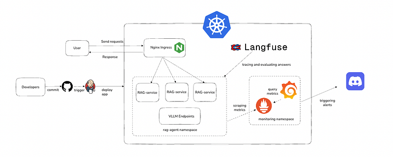

# AGENTIC RAG SYSTEMS 🤖

**Agentic RAG System with Rules, Local Documents, and Web Search**

A production-ready Retrieval-Augmented Generation (RAG) system that combines local document retrieval, web search capabilities, and intelligent guardrails to provide safe, accurate, and contextual AI responses.



## 🚀 Features

### Core Capabilities
- **🧠 Agentic RAG**: Intelligent retrieval with decision-making capabilities
- **📚 Local Document Processing**: Ingest and query your private documents
- **🌐 Web Search Integration**: Real-time web search for up-to-date information
- **🛡️ Advanced Guardrails**: Content filtering and safety mechanisms
- **📊 Full Observability**: Monitoring with Prometheus, Grafana, and Langfuse
- **⚡ Auto-scaling**: Kubernetes-ready with HPA support

### Security & Safety
- **Content Filtering**: PII detection and removal
- **Query Validation**: Malicious input detection
- **Response Sanitization**: Safe output generation
- **Audit Logging**: Complete request/response tracking

### Production Features
- **High Availability**: Multi-replica deployment
- **Load Balancing**: Nginx reverse proxy
- **Monitoring**: Real-time metrics and alerting
- **CI/CD Pipeline**: Automated testing and deployment
- **Container Security**: Vulnerability scanning

## 📋 Table of Contents
- [Architecture](#architecture)
- [Quick Start](#quick-start)
- [Installation](#installation)
- [Configuration](#configuration)
- [API Documentation](#api-documentation)
- [Deployment](#deployment)
- [Monitoring](#monitoring)
- [Development](#development)
- [Testing](#testing)
- [Contributing](#contributing)
- [License](#license)

## Architecture

```
┌─────────────────┐    ┌─────────────────┐    ┌─────────────────┐
│     Client      │───▶│   Nginx Proxy   │───▶│   RAG API       │
│   Application   │    │  Load Balancer  │    │  (FastAPI)      │
└─────────────────┘    └─────────────────┘    └─────────────────┘
                                                       │
                        ┌─────────────────┐            │
                        │   Guardrails    │◀───────────┤
                        │   & Security    │            │
                        └─────────────────┘            │
                                                       │
┌─────────────────┐    ┌─────────────────┐             │
│   ChromaDB      │◀───│   Document      │◀───────────-┤
│  Vector Store   │    │   Processing    │             │
└─────────────────┘    └─────────────────┘             │
                                                       │
┌─────────────────┐    ┌─────────────────┐             │
│   External      │◀───│   Web Search    │◀───────────-┤
│   Ollama LLM    │    │   & Retrieval   │             │
└─────────────────┘    └─────────────────┘             │
                                                       │
┌─────────────────┐    ┌─────────────────┐             │
│   Langfuse      │◀───│  Observability  │◀──────────--┘
│   Tracking      │    │   & Metrics     │
└─────────────────┘    └─────────────────┘
                              │
                    ┌─────────────────┐
                    │   Prometheus    │
                    │   & Grafana     │
                    └─────────────────┘
```

### Key Components

1. **RAG API** (`app/api.py`): FastAPI-based REST API with dual endpoints
2. **Guardrails** (`app/guardrails.py`): Security and content filtering
3. **Document Processing** (`app/rag.py`): Vector embeddings and retrieval
4. **Settings Management** (`app/settings.py`): Configuration management
5. **Observability** (`app/metrics.py`): Prometheus metrics integration

## Quick Start

### Prerequisites

- Python 3.11+
- Docker & Docker Compose
- Kubernetes cluster (for production)
- External Ollama instance
- GCP account (for GKE deployment)

### Local Development

```bash
# 1. Clone the repository
git clone <your-repo-url>
cd RAG_DWYEROMEGA

# 2. Set up virtual environment
python -m venv venv
source venv/bin/activate  # On Windows: venv\Scripts\activate

# 3. Install dependencies
pip install -r requirements.txt

# 4. Set up environment variables
cp .env.example .env
# Edit .env with your configuration

# 5. Start local services
docker-compose up -d chroma

# 6. Run the API
uvicorn app.api:app --host 0.0.0.0 --port 8080 --reload

# 7. Access the API
open http://localhost:8080/docs
```

### Docker Development

```bash
# Start the complete stack with monitoring
chmod +x start-monitoring.sh
./start-monitoring.sh

# Access services
echo "API: http://localhost:8080"
echo "Docs: http://localhost:8080/docs"
echo "Grafana: http://localhost:3000 (admin/admin123)"
echo "Prometheus: http://localhost:9090"
```

## Installation

### System Requirements

**Minimum:**
- 4 CPU cores
- 8GB RAM
- 50GB storage

**Recommended:**
- 8 CPU cores
- 16GB RAM
- 100GB SSD storage

### Dependencies

```bash
# Core dependencies
pip install fastapi uvicorn langchain chromadb ollama

# Observability
pip install prometheus-client langfuse opentelemetry-api

# Security
pip install python-dotenv pydantic-settings

# Development
pip install pytest black flake8 pre-commit
```

## Configuration

### Environment Variables

Create a `.env` file in the project root:

```bash
# Core RAG Settings
OLLAMA_URL=http://localhost:11434
CHROMA_HOST=localhost
CHROMA_PORT=8000
MODEL_NAME=llama3:latest
EMBED_MODEL=sentence-transformers/all-MiniLM-L6-v2
COLLECTION=docs

# Observability
LANGFUSE_HOST=http://localhost:3000
LANGFUSE_PUBLIC_KEY=pk-lf-your-public-key
LANGFUSE_SECRET_KEY=sk-lf-your-secret-key
PROMETHEUS_ENABLED=true

# Security
GUARDRAILS_ENABLED=true
PII_DETECTION=true
CONTENT_FILTERING=strict

# Performance
MAX_CONCURRENT_REQUESTS=100
REQUEST_TIMEOUT=60
CACHE_TTL=3600
```

### Application Settings

The application uses Pydantic settings for type-safe configuration:

```python
# app/settings.py
class Settings(BaseSettings):
    ollama_url: str = "http://localhost:11434"
    chroma_host: str = "localhost"
    chroma_port: int = 8000
    model_name: str = "llama3:latest"
    # ... more settings
```

## API Documentation

### Endpoints

#### Health Check
```http
GET /health
```
Returns service health status and metadata.

#### Basic RAG Query
```http
POST /rag
Content-Type: application/json

{
  "query": "What is machine learning?",
  "user_id": "optional-user-id",
  "session_id": "optional-session-id",
  "metadata": {}
}
```

#### Guarded RAG Query
```http
POST /rag_guarded
Content-Type: application/json

{
  "query": "Explain neural networks with examples",
  "user_id": "user123",
  "session_id": "session456",
  "metadata": {"source": "web_app"}
}
```

**Response:**
```json
{
  "answer": "Neural networks are computational models...",
  "sources": ["document1.pdf", "document2.txt"],
  "user_id": "user123",
  "session_id": "session456",
  "safety_status": "safe",
  "warnings": null,
  "filtered_content": false
}
```

#### Metrics
```http
GET /metrics
```
Returns Prometheus metrics for monitoring.

### Error Handling

The API returns standard HTTP status codes:

- `200 OK`: Successful request
- `400 Bad Request`: Invalid input
- `422 Unprocessable Entity`: Validation error
- `429 Too Many Requests`: Rate limited
- `500 Internal Server Error`: Server error
- `503 Service Unavailable`: External service unavailable

## Deployment

### Kubernetes (GKE)

```bash
# 1. Update configuration
# Edit deploy-rag-api.sh with your PROJECT_ID and EXTERNAL_OLLAMA_IP

# 2. Deploy to GKE
chmod +x deploy-rag-api.sh
./deploy-rag-api.sh

# 3. Verify deployment
kubectl get pods -n rag-services
kubectl get svc -n rag-services
```

### Docker Compose

```bash
# Production deployment with all services
docker-compose -f docker-compose.observability.yml up -d

# Monitor deployment
docker-compose logs -f rag-api
```

### Environment-Specific Deployments

**Development:**
```bash
# Deploys to rag-services-dev namespace
git push origin develop
```

**Production:**
```bash
# Requires manual approval in Jenkins
git push origin main
```

## Monitoring

### Metrics Available

**Application Metrics:**
- `rag_requests_total`: Total API requests
- `rag_request_duration_seconds`: Request latency
- `rag_active_sessions`: Active user sessions
- `guardrail_violations_total`: Security violations
- `ollama_request_duration_seconds`: LLM response time

**Infrastructure Metrics:**
- CPU and memory usage
- Network I/O
- Disk usage
- Container health

### Dashboards

Access pre-built dashboards:
- **Grafana**: `http://localhost:3000` (admin/admin123)
- **Prometheus**: `http://localhost:9090`
- **Langfuse**: `http://localhost:3000/langfuse`

### Alerting

Configure alerts for:
- High error rates (>5%)
- Slow response times (>10s)
- Resource exhaustion (>80% CPU/memory)
- Security violations
- External service failures

## Development

### Project Structure

```
RAG_DWYEROMEGA/
├── app/                    # Application code
│   ├── api.py             # FastAPI application
│   ├── rag.py             # RAG implementation
│   ├── guardrails.py      # Security and filtering
│   ├── settings.py        # Configuration
│   └── metrics.py         # Prometheus metrics
├── deployments/           # Kubernetes manifests
│   └── rag-services/     # Service definitions
├── monitoring/           # Observability configs
│   ├── prometheus.yml    # Prometheus config
│   └── grafana/         # Grafana dashboards
├── tests/               # Test suite
│   ├── unit/           # Unit tests
│   ├── integration/    # Integration tests
│   └── smoke_tests.py  # Smoke tests
├── docs/               # Documentation
├── Dockerfile          # Container definition
├── requirements.txt    # Python dependencies
├── Jenkinsfile        # CI/CD pipeline
└── README.md          # README file

### Pre-commit Hooks

```bash
# Install pre-commit
pip install pre-commit
pre-commit install

# Manual run
pre-commit run --all-files
```

## Testing

### Unit Tests

```bash
# Run all tests
python -m pytest tests/

# Run with coverage
python -m pytest tests/ --cov=app --cov-report=html

```


### Load Testing

```bash
# Generate test traffic
python test-monitoring.py

# Load test specific endpoint
ab -n 1000 -c 10 http://localhost:8080/health
```

### Smoke Tests

```bash
# Test deployment
python tests/smoke_tests.py --endpoint=http://localhost:8080 --environment=dev
```

## 🔧 Troubleshooting

### Common Issues

**Q: API is slow to respond**
```bash
# Check resource usage
kubectl top pods -n rag-services

# Check logs
kubectl logs -f deployment/rag-api -n rag-services

# Scale up if needed
kubectl scale deployment rag-api --replicas=5 -n rag-services
```

**Q: Guardrails are blocking valid content**
```bash
# Adjust guardrail sensitivity in settings
GUARDRAIL_SENSITIVITY=low

# Check violation logs
grep "guardrail_violation" logs/app.log
```

**Q: External Ollama not reachable**
```bash
# Test connectivity from pod
kubectl exec -it <pod-name> -n rag-services -- curl http://YOUR_OLLAMA_IP:11434/api/tags

# Check firewall rules
# Ensure Ollama is accessible from GKE cluster
```

### Debug Commands

```bash
# Check cluster status
kubectl get nodes
kubectl get pods --all-namespaces

# View detailed pod info
kubectl describe pod <pod-name> -n rag-services

# Access pod shell
kubectl exec -it <pod-name> -n rag-services -- /bin/bash

# Port forward for debugging
kubectl port-forward svc/rag-api-service 8080:8080 -n rag-services
```

## Contributing

### Getting Started

1. Fork the repository
2. Create a feature branch: `git checkout -b feature/amazing-feature`
3. Make your changes
4. Add tests for new functionality
5. Ensure all tests pass: `python -m pytest`
6. Commit your changes: `git commit -m 'Add amazing feature'`
7. Push to the branch: `git push origin feature/amazing-feature`
8. Open a Pull Request

### Development Workflow

```bash
# 1. Start development environment
./start-monitoring.sh

# 2. Make changes and test
python -m pytest tests/
python test-monitoring.py

# 3. Check code quality
black app/ && flake8 app/

# 4. Commit and push
git add .
git commit -m "Your descriptive message"
git push origin your-branch
```

### Code Review Guidelines

- Write clear, descriptive commit messages
- Add tests for new features
- Update documentation as needed
- Follow existing code style
- Ensure CI/CD pipeline passes

## Performance

### Benchmarks

**Typical Performance:**
- Health check: < 10ms
- Simple RAG query: 2-5 seconds
- Complex guarded query: 10-20 seconds
- Concurrent requests: 20+ RPS

**Optimization Tips:**
- Use connection pooling for external services
- Implement response caching
- Optimize vector search parameters
- Scale horizontally with HPA

## Security

### Security Features

- **Input Validation**: Pydantic models with strict validation
- **Output Sanitization**: PII removal and content filtering
- **Rate Limiting**: Nginx-based request throttling
- **Container Security**: Non-root user, minimal base image
- **Network Security**: Service mesh ready

### Security Best Practices

- Regularly update dependencies
- Monitor security alerts
- Use secrets management
- Enable audit logging
- Follow principle of least privilege

## License

This project is licensed under the MIT License - see the [LICENSE](LICENSE) file for details.

## Acknowledgments

- [LangChain](https://python.langchain.com/) for RAG framework
- [FastAPI](https://fastapi.tiangolo.com/) for web framework
- [ChromaDB](https://www.trychroma.com/) for vector storage
- [Ollama](https://ollama.ai/) for local LLM inference
- [Langfuse](https://langfuse.com/) for LLM observability

---

**Built for production-ready AI applications**


